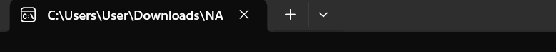

# Penjelasan Program
Apa itu Program Ini?
Program ini adalah aplikasi buku nilai digital. Tugasnya membantu kamu mencatat NIM dan tiga jenis nilai (Tugas, UTS, UAS) mahasiswa secara rapi tanpa perlu kalkulator manual untuk menghitung rata-rata.


## Fitur Utama:
- Input Instan: Bisa memasukkan 22 data mahasiswa sekaligus secara otomatis.
- Kelola Data: Bisa tambah, lihat, hapus, atau ubah nilai jika ada salah input.
- Tabel Rapi: Data ditampilkan dalam bentuk tabel kotak-kotak yang enak dilihat.
- Statistik: Otomatis mencari siapa nilai tertinggi, terendah, dan rata-rata kelas.
- Bonus Matematika: Bisa menghitung angka Faktorial dan Fibonacci.

## Cara Menjalankan (Simple):
1. Kompilasi (Bungkus Kode): Ketik ``` gcc nama_file.c -o``` program di terminal.
2. Jalankan: Ketik ``` ./program``` (Linux/Mac) atau program.exe (Windows).  
3. Gunakan: Pilih angka 1 untuk isi data, lalu angka 2 untuk melihat hasilnya.

## Screenshoot Program

